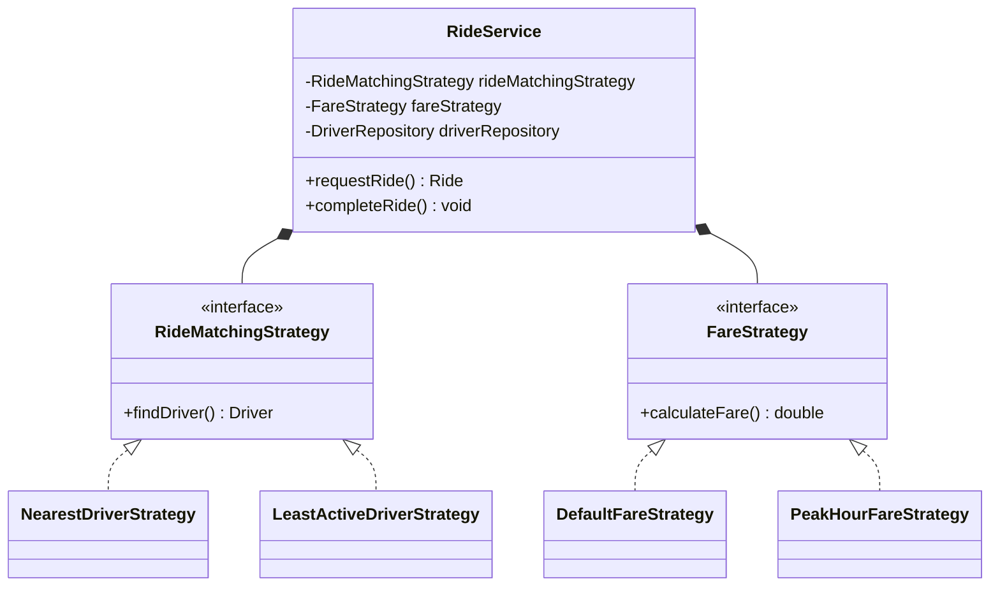

# RideWise 🚗💨

RideWise is a core backend, reactive-ready engine for an interactive ride-sharing platform developed in modern Java. Built with strong Object-Oriented Design (OOD) foundations, it orchestrates rider onboarding, driver matching via pluggable algorithms, and dynamic tolling/fare estimation systems.

---

## 🚀 Key Features

* **Dynamic Strategy Routing:** Instantly swaps between core matching routines like *Nearest Available* or workload-balancing *Least Active*.
* **Temporal Dynamic Pricing:** Implements time-aware fare calculations with automated surge-pricing detection during peak morning and evening traffic windows.
* **Domain Inversion Architecture:** Fully decoupled business contracts separating persistent repositories from transactional workflow logic.
* **Thread-Safe Domain Management:** Leverages atomic safe counters and atomic tracking to eliminate identifier collisions.

---

## 🛠️ Architecture & Design Patterns

The system heavily embraces **SOLID Design Principles** and utilizes the following GoF design patterns to maintain an extensible codebase:

* **Strategy Pattern:** Decouples pricing and matching algorithms (`FareStrategy`, `RideMatchingStrategy`) from the main `RideService` engine so new business rules can be added without modifying existing code.
* **Dependency Injection:** Constructors inject decoupled interface definitions rather than instantiating hardcoded concrete configurations.
* **Separation of Concerns:** Distinct partitioning across UI routing (`Main`), business rules (`Services`), and the in-memory persistence layer (`Repositories`).




## 💻 Tech Stack & Environment Matrix

| Component | Specification | Details |
| :--- | :--- | :--- |
| **Language Runtime** | **Java SE 17 (LTS)** or higher | Compatible up to **Java 21 / 25** |
| **Language Features** | Modern Java (Java 8+ Foundations) | Streams API, Lambda Expressions, Local-Variable Type Inference (`var`) |
| **Concurrency Model** | Memory-Safe Thread Containers | `ConcurrentHashMap`, `AtomicInteger`, `AtomicLong` |

---

## ⚙️ JDK Installation & Configuration

To compile and execute this system safely, ensure your local Java environment matches the following criteria to prevent classpath or compiler compliance issues.

### Verify Local Runtime
Open your terminal or terminal emulator and verify your primary runtime toolchain:
```bash
java --version
javac --version
```


## 💻 Console Interface Walkthrough
The main loop presents a continuous, interactive command-line application routing system
```
(1) register Rider 
(2) register driver 
(3) view all available drivers 
(4) request a ride 
(5) complete a ride 
(6) view all rides 
(7) Exit
```